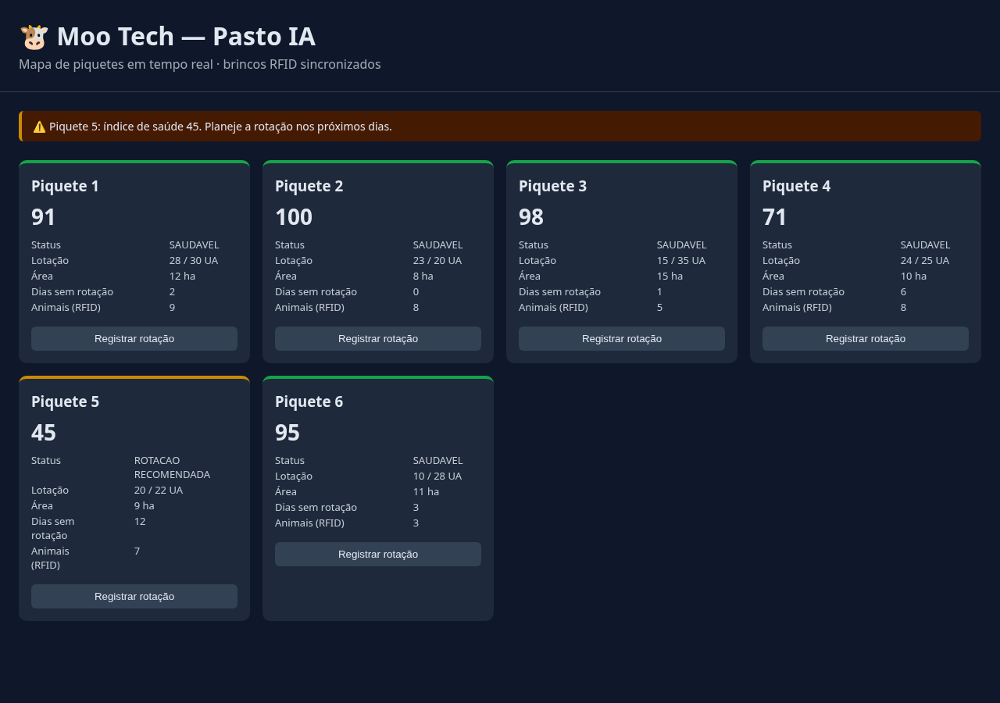

<p align="center">
  
</p>

<h1 align="center">🐮 Moo Tech — Pasto Inteligente</h1>
<p align="center"><b>Cofundador &amp; CEO</b> · Participante do <b>Programa Centelha 3 Goiás (MCTI)</b></p>

<p align="center">
  
  
  
  
  
  
</p>

## 📸 Protótipo em ação

<p align="center">
  
</p>

<p align="center"><i>Mapa de piquetes real, gerado pelo protótipo deste repositório — não é mockup. Rode você mesmo em <a href="#como-começar">Como Começar</a>.</i></p>

## O Problema

Goiás produz **R$ 21,7 bilhões** em pecuária, mas a gestão da maior parte das fazendas ainda é feita em caderno. Isso não é uma suposição — validamos com o **IFAG (Instituto para o Fortalecimento da Agropecuária de Goiás)**, que ouviu produtores reais com metodologia GUT+GOI ponderada pelo peso econômico do setor (VBP R$ 119,4bi em Goiás):

| Ranking | Dor validada | Score |
|---|---|---|
| 1º | Disponibilidade e qualificação de mão de obra | 1.242 |
| 2º | Manejo nutricional e qualidade das pastagens | 1.107 |
| 3º | Organização coletiva da cadeia produtiva | 1.103 |
| 4º | Eficiência reprodutiva e sanidade do rebanho | 919 |
| 5º | Gestão produtiva e econômica baseada em dados | 880 |

85% dos produtores rurais brasileiros nunca usaram nenhum software de gestão. Cada módulo da Moo Tech responde diretamente a uma dessas dores ranqueadas — em vez de vender "eficiência" genérica, como o resto do mercado.

## A Solução

Hardware + software para automatizar o que hoje é feito manualmente ou não é feito:

- **Cuidar do Rebanho** — brinco RFID (UHF) + portão inteligente: cada animal é identificado automaticamente, sem digitação manual.
- **Cuidar do Pasto** — Pasto IA: mapa de piquetes ao vivo, com alerta de superpastejo *antes* de acontecer e sugestão de rotação ideal com base em tempo de descanso e lotação animal.
- **Cuidar do Financeiro** — custo por arroba, margem por lote, projeção de resultado.
- **Vacinação registrada automaticamente** — no momento do manejo, o app identifica o animal via RFID e registra a aplicação, sem papel.
- **Offline-first** — funciona sem sinal no campo e sincroniza quando houver conexão.

## Status

**Protótipo funcional** deste repositório: o módulo **Pasto IA** (mapa de piquetes + alertas de superpastejo), com backend, banco de dados e dashboard reais e executáveis localmente — ver [Como Começar](#como-começar). Integração com o hardware físico (brinco RFID Sense) ainda não está neste repositório.

**Participante do Programa Centelha 3 Goiás (MCTI)** — validação de mercado feita com pesquisa IFAG (metodologia GUT+GOI).

## Stack Técnico

| Camada | Tecnologia |
|---|---|
| Backend | Node.js + Express |
| Banco de dados | Prisma ORM (SQLite no protótipo / PostgreSQL em produção) |
| Frontend (protótipo) | HTML + JS (dashboard do mapa de piquetes) |
| Frontend (produto) | App mobile offline-first |
| Hardware | RFID UHF (brinco + portão de leitura) |
| Dados externos (roadmap) | SISBOV, MapBiomas, PRODES (rastreabilidade ESG) |

## Arquitetura

```
┌─────────────────┐      ┌──────────────────┐      ┌───────────────────────┐
│   Hardware       │      │                  │      │                       │
│  Brinco RFID UHF │ ───► │  Backend         │ ───► │  Frontend              │
│  Portão leitor   │      │  (Node/Express   │      │  Mobile (produto,      │
│  Sensores        │      │   + Prisma)      │      │  offline-first)        │
└─────────────────┘      │                  │      │  Dashboard web         │
                          │  - Cadastro de   │      │  (protótipo, incluso   │
                          │    animal/RFID   │      │   neste repo)          │
                          │  - Cálculo de    │      └───────────────────────┘
                          │    índice de     │
                          │    saúde do      │
                          │    pasto         │
                          │  - Alertas de    │
                          │    superpastejo  │
                          └──────────────────┘
                                   │
                                   ▼
                          ┌──────────────────┐
                          │  PostgreSQL       │
                          │  (SQLite no       │
                          │   protótipo)      │
                          └──────────────────┘
```

## Como Começar

```bash
npm install
cp .env.example .env

npx prisma migrate dev --name init   # cria o banco e aplica o schema
npm run seed                          # popula com uma fazenda de demonstração
npm run dev                           # sobe o dashboard em http://localhost:3000
```

O seed cria 6 piquetes em diferentes estágios de pastejo — pelo menos um já nasce em risco de superpastejo, para você ver o alerta funcionando imediatamente. O botão "Registrar rotação" em cada piquete simula o manejo real: zera os dias de descanso, recalcula o índice de saúde e resolve o alerta.

## 📅 Diário de Desenvolvimento

> Atualize esta tabela a cada sessão de trabalho — uma linha por dia é suficiente. É o histórico que mostra evolução real, não só o resultado final.

| Data | O que mudou |
|---|---|
| 2026-09-14 | Protótipo do **Pasto IA** publicado: schema Prisma (Farm, Piquete, Animal/RFID, Alerta), regra de saúde do pasto, API Express e dashboard funcionando ponta a ponta — alerta de superpastejo gerado e resolvido em tempo real via "Registrar rotação". |

## Roadmap

- [ ] Integração com hardware real (brinco RFID Sense)
- [ ] Dashboard de alertas em tempo real (push/websocket)
- [ ] Autenticação OAuth2 para fazendeiros
- [ ] Exportação de dados em CSV/PDF
- [ ] Documentação da API REST
- [ ] Rastreabilidade ESG (SISBOV + MapBiomas + PRODES)

## Licença

MIT — veja [LICENSE](./LICENSE).
